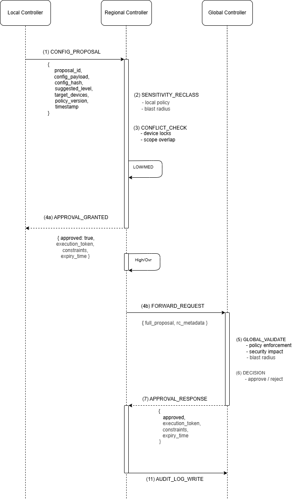
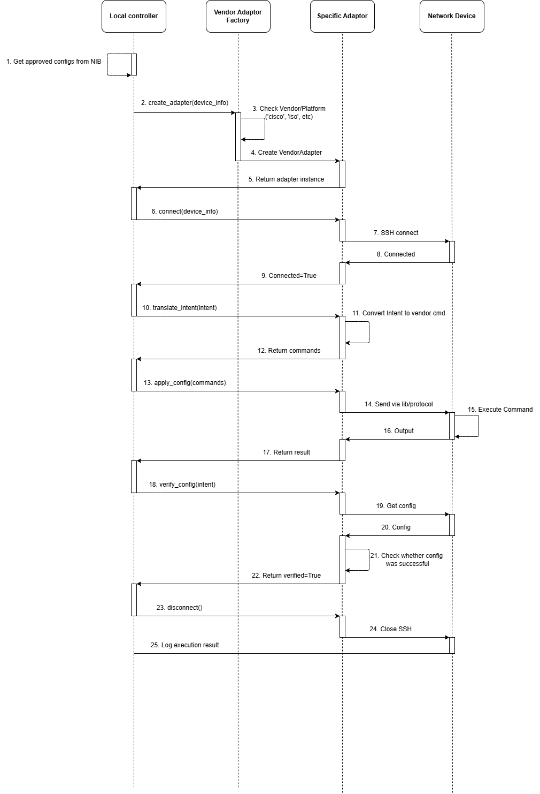

# Configuration approval

The configuration approval system governs how changes are proposed, classified, approved, and executed across the PDSNO controller hierarchy. It is the most operationally significant flow in the system — every change to a managed network device passes through it.

Its purpose is to balance four competing requirements: security (prevent unauthorised or unsafe changes), speed (avoid bottlenecks on low-risk changes), scalability (work across large multi-region deployments), and auditability (every decision is traceable and reconstructible).

---

## Sensitivity levels

Every configuration request is classified into one of four sensitivity levels. The level determines the approval path.

| Level | Description | Approval path |
|-------|-------------|---------------|
| **LOW** | Safe, localised, reversible | LC direct execution or RC auto-approval |
| **MEDIUM** | Operational impact, limited scope | Regional Controller approval required |
| **HIGH** | Core network, security-critical, multi-region | Global Controller approval required |
| **EMERGENCY** | Immediate risk mitigation — active incident | LC executes immediately; RC and GC notified post-facto |

**The critical rule:** Lower-tier controllers may *suggest* a sensitivity level, but higher tiers always re-classify independently. A Local Controller's suggested sensitivity is advisory only — never authoritative. A compromised LC claiming LOW for a destructive change is caught at the Regional Controller.

---

## The approval flow

!!! note "Draft diagrams"
  These diagrams are not final. They will continue to improve as PDSNO matures, but they already communicate the intended approval and execution model.





### Stage 1 — LC: Proposal creation

The Local Controller validates that target devices exist in the NIB and are reachable, then creates the proposal:

- Generates a `proposal_id` and `config_hash` (SHA-256 of the normalised config payload)
- Suggests a sensitivity level based on local policy evaluation
- Builds a **rollback payload** — the instructions to undo this change if execution fails. Required at proposal time, not constructed after failure.
- Writes the proposal to the Config Table with status `PENDING`
- Sends to the Regional Controller

!!! important "Rollback payload is mandatory"
    A proposal cannot be submitted without a rollback payload for MEDIUM sensitivity and above. This forces the proposer to think about reversal before the change is approved. If a change cannot be reversed, it must be declared as such and subject to a higher approval threshold.

**Emergency path:** If the suggested sensitivity is `EMERGENCY`, the LC executes immediately without waiting for approval, then notifies RC and GC asynchronously. See the [emergency section](#emergency-fast-path) below.

---

### Stage 2 — RC: Classification and decision

The Regional Controller re-classifies sensitivity independently, checks for conflicts, and decides:

**Re-classification** runs against the RC's own policy. The LC's suggestion is logged but does not influence the RC's decision. If the RC classifies differently from the LC's suggestion, the RC's classification prevails.

**Policy version check** — the proposal's `policy_version` must match the RC's current active policy version. Mismatched versions are rejected with `POLICY_VERSION_MISMATCH`. This prevents a proposal submitted under an outdated policy from slipping through under changed rules.

**Conflict check** — for each target device, the RC checks the Controller Sync Table for an active `CONFIG_LOCK`. If a lock exists, the proposal is queued or rejected depending on priority policy.

**Lock acquisition** — if no conflicts, the RC acquires a `CONFIG_LOCK` for each target device. These locks are held until execution is confirmed. Acquiring locks at approval time prevents concurrent conflicting changes from racing to execute.

**Decision:**
- LOW / MEDIUM → RC approves, issues execution token, instructs LC
- HIGH → RC escalates to GC, awaits response (300s timeout; default-deny on timeout)
- EMERGENCY → handled separately

---

### Stage 3a — RC approves LOW/MEDIUM

The RC issues a signed execution token and sends an execution instruction to the LC.

**Execution tokens** are cryptographically bound to:

```
proposal_id     → this specific proposal only
config_hash     → this specific config payload
target_devices  → these specific devices only
approved_by     → the approving controller's identity
issued_at       → timestamp
expires_at      → TTL: 10 minutes for LOW/MEDIUM, 5 minutes for HIGH
constraints     → rate limits, rollback requirements, maintenance window flags
signature       → HMAC-SHA256 of all fields above
```

A token issued for `nib-dev-001` cannot execute a change on `nib-dev-002`. A token for proposal `abc-123` cannot authorise any other proposal. Tokens are single-use — consumed before execution begins.

---

### Stage 3b — RC escalates HIGH to GC

For HIGH-sensitivity changes, the RC forwards the proposal to the Global Controller with additional context:

- Computed blast radius (count and criticality of affected devices)
- List of critical devices in the affected set
- Regional policy version
- RC's own metadata

The RC waits up to 300 seconds for a GC response. If no response arrives, the RC defaults to DENY and releases all locks. This safe-fail default prevents a GC outage from leaving approvals in limbo indefinitely.

---

### Stage 4 — GC: Global validation

The Global Controller applies its own checks before approving a HIGH change:

1. **Immutable policy rules** — if the proposed change conflicts with a GC-flagged immutable rule, it is denied immediately. Immutable rules cannot be overridden by regional or local policy or by escalation.
2. **Cross-region impact** — if the change affects devices in more than `policy.max_regions_per_change` regions, it is denied.
3. **Final approval** — if all checks pass, the GC issues a HIGH-category execution token with a tighter TTL (5 minutes) and returns it to the RC, which forwards it to the LC.

---

### Stage 5 — LC: Token verification and execution

Before touching any device, the LC runs a complete token verification:

1. Token has not expired
2. Token signature is valid
3. Token bindings match the actual execution context (proposal ID, config hash, device list, approver)
4. Token has not been used before — consumed atomically before execution begins

The LC writes `EXECUTING` to the Config Table **before** touching any device. This ensures that if the LC crashes mid-execution, the NIB reflects an incomplete state and the next reconciliation cycle can handle it correctly.

Execution applies the config to each target device. On success, the LC writes `EXECUTED`, releases all device locks, and reports the result upstream.

---

### Stage 6 — LC: Rollback

If any device execution fails, the LC initiates rollback:

```
EXECUTING → ROLLING_BACK → ROLLED_BACK (success)
                        └── DEGRADED (rollback also failed)
```

The rollback payload was stored at proposal time. The LC applies it to restore each device to its prior state. If rollback itself fails, the device enters `DEGRADED` state:

- All further automated configuration changes for that device are blocked
- An escalation is raised to RC and GC
- A human operator must explicitly review and resolve the state

`DEGRADED` is an intentional forcing function — it is better to block automation than to keep applying changes to a device in an unknown state.

---

## Config status state machine

```
PENDING
   │
   ├── RC denies ────────────────────────────► DENIED
   │
   ├── RC approves (LOW/MEDIUM) ────────────► APPROVED ──► EXECUTING
   │                                                            │
   ├── RC escalates (HIGH)                                      ├──► EXECUTED ──► (done)
   │     └── GC denies ──────────────────────► DENIED          │
   │     └── GC approves ────────────────────► APPROVED        ├──► ROLLED_BACK
   │                                                            │
   └── Emergency ──────────────────────────► EXECUTING         └──► DEGRADED
                                                  │
                                          RC/GC may deny post-facto → rollback
```

---

## Escalation triggers

An RC must escalate to GC when any of these conditions are true:

- `impact_scope == "global"`
- Target devices span more than one region
- `estimated_downtime_seconds` exceeds `policy.escalation_downtime_threshold`
- Any target device is flagged `critical` in the NIB Metadata Store
- RC policy explicitly requires GC sign-off for that device type

An LC must escalate to RC (instead of executing directly) when:

- Local NIB data for a target device is stale (older than `policy.stale_threshold`)
- Any target device has a `quarantined` or `suspicious` flag in the NIB
- Local policy marks the device as protected

---

## Emergency fast path

Emergency mode exists to contain damage in active incidents — not to bypass governance.

```
LC detects incident → creates EMERGENCY proposal
    Rate limiter allows? → LC executes immediately
    Config type on permitted list? → only quarantine, rate-limit, null-route allowed
    Device role permitted? → edge devices only by default
    └── Write EXECUTING → apply config → write EXECUTED
    └── Write EMERGENCY_EXECUTION audit entry (mandatory, includes full payload)
    └── Notify RC and GC asynchronously (10-minute acknowledgement window)
         └── If RC/GC deny retrospectively → rollback protocol runs
```

Emergency constraints:

- **Rate-limited** — default 3 emergency invocations per controller per hour
- **Restricted config types** — only specific containment actions are permitted
- **Restricted device roles** — edge devices only by default; core devices require normal approval
- **Always audited** — the `EMERGENCY_EXECUTION` event is the most detailed audit entry in the system, not the least

!!! warning "Emergency ≠ bypass"
    Emergency mode is the most heavily audited path, not the least. Rate limiting, permitted-type restrictions, and mandatory post-facto acknowledgement together ensure emergency mode cannot be used as a routine governance bypass. Repeated emergency invocations without corresponding post-facto approvals trigger automatic controller suspension.

---

## Execution token structure

```json
{
  "token_id": "uuid-v4",
  "proposal_id": "uuid-v4",
  "config_hash": "sha256-hex",
  "target_devices": ["nib-dev-001", "nib-dev-002"],
  "approved_by": "regional_cntl_zoneA_1",
  "issued_at": "2026-02-16T10:30:00Z",
  "expires_at": "2026-02-16T10:40:00Z",
  "constraints": {
    "max_devices_per_minute": 10,
    "rollback_required_on_failure": true,
    "maintenance_window_required": false
  },
  "signature": "hmac-sha256-of-all-fields-above"
}
```

---

## Timeouts and retry contracts

| Operation | Timeout | On failure |
|-----------|---------|------------|
| LC → RC proposal send | 30s, 3 retries (exponential backoff) | Queue locally; retry after `policy.rc_retry_interval` |
| RC → GC escalation response | 300s, no retry | Default DENY; release all locks |
| Execution token TTL (LOW/MEDIUM) | 600s | LC must request re-approval |
| Execution token TTL (HIGH) | 300s | LC must request re-approval |
| Emergency post-facto acknowledgement | 600s | RC/GC may issue retrospective rollback |
| Approval lock TTL | 900s | Background cleanup releases stale locks |

---

## NIB writes per stage

Every stage has mandatory NIB writes. A stage is not complete until its writes are done.

| Stage | Write | Table |
|-------|-------|-------|
| LC proposal | `create_config_proposal()` | Config Table → `PENDING` |
| LC proposal | `write_event(CONFIG_PROPOSED)` | Event Log |
| RC lock | `acquire_lock()` | Controller Sync |
| RC approve | `update_config_status()` | Config Table → `APPROVED` + token |
| RC approve | `write_event(CONFIG_APPROVED)` | Event Log |
| RC escalate | `write_event(CONFIG_ESCALATED)` | Event Log |
| RC/GC deny | `update_config_status()` | Config Table → `DENIED` |
| RC/GC deny | `release_lock()` | Controller Sync |
| LC execute start | `update_config_status()` | Config Table → `EXECUTING` |
| LC execute end | `update_config_status()` | Config Table → `EXECUTED` |
| LC execute end | `release_lock()` | Controller Sync |
| LC rollback | `update_config_status()` | Config Table → `ROLLED_BACK` or `DEGRADED` |
| LC rollback fail | `update_device_status()` | Device Table → `degraded` |
| Emergency | `write_event(EMERGENCY_EXECUTION)` | Event Log |

---

## Related pages

- [Controller hierarchy](controller-hierarchy.md) — which tier approves what
- [Network Information Base](network-information-base.md) — Config Table and Controller Sync Table schemas
- [Security model](security-model.md) — how execution tokens resist replay and tampering
- [Threat model](../security/threat-model.md) — T1 (sensitivity spoofing), T2 (emergency abuse), T4 (token replay)
- [API reference](../reference/api-reference.md) — CONFIG_PROPOSAL, APPROVAL_RESPONSE, EXECUTION_INSTRUCTION message schemas