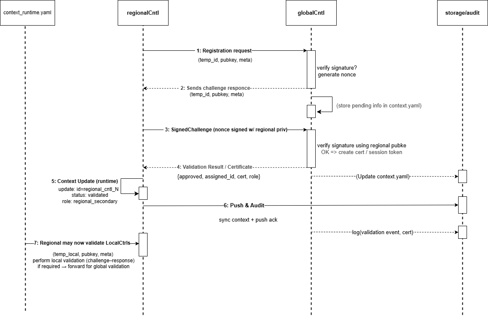

# Controller validation

Before any controller participates in PDSNO — sending commands, approving configurations, writing to the NIB — it must pass a six-step cryptographic validation flow. This page documents that flow in full, including the security reasoning behind each step, all error states, and how the trust chain is established and maintained.

---

## Why validation exists

PDSNO's governance properties depend entirely on knowing that every controller in the hierarchy is legitimate. A rogue process that could impersonate a Regional Controller could approve its own configuration changes, write to the NIB, and generate fraudulent audit records.

Validation prevents this by requiring every controller to:

1. Prove it was legitimately provisioned (bootstrap token)
2. Prove it controls the private key it claims (challenge-response)
3. Pass policy checks for its claimed region and type

These three checks together are what "trust" means in PDSNO — not network position, not IP address, not hostname.

---

## The trust chain

```
Global Controller
    └── validates → Regional Controllers
                        └── validates → Local Controllers
```

The Global Controller is the root of trust. It directly validates Regional Controllers. Validated Regional Controllers receive a **delegation credential** that allows them to validate Local Controllers within their zone. This delegation is scoped and signed — an RC cannot use its delegation credential to validate RCs, or to validate LCs outside its zone.

A Local Controller submits its validation request to its Regional Controller, not the Global Controller. The RC runs the identical six-step flow that the GC ran against it.

---

## The six-step flow

```
Requesting Controller                 Validating Controller
        │                                      │
        │ ── VALIDATION_REQUEST ──────────────►│
        │                                      │ Step 1: Timestamp + blocklist
        │                                      │ Step 2: Bootstrap token
        │                                      │
        │◄── CHALLENGE ─────────────────────── │ Step 3: Issue challenge
        │                                      │
        │ ── CHALLENGE_RESPONSE ──────────────►│
        │                                      │ Step 4: Verify signature
        │                                      │ Step 5: Policy checks
        │                                      │ Step 6: Assign identity
        │◄── VALIDATION_RESULT ─────────────── │
        │    {assigned_id, cert, role}          │
```

!!! note "Draft diagram"
  This diagram is an early working version. It may be refined as the project evolves, but it captures the current validation flow clearly.



---

### Step 1 — Timestamp and blocklist

**Purpose:** Reject stale requests and known-bad controllers before doing any expensive cryptographic work.

The validating controller checks two things:

- **Timestamp freshness** — the request timestamp must be within ±5 minutes of the validator's clock. Requests older than 5 minutes are rejected as `STALE_TIMESTAMP`. Requests with future timestamps are rejected as `FUTURE_TIMESTAMP` — this catches clock skew and replay attempts.
- **Blocklist** — the `temp_id` is checked against a blocklist of known-bad or revoked controller identifiers. Blocklisted requests are rejected immediately.

The blocklist check happens *before* any HMAC verification. This ensures a known-bad controller cannot use a validation attempt to consume validator resources.

---

### Step 2 — Bootstrap token verification

**Purpose:** Confirm the requesting controller was legitimately provisioned.

The bootstrap token is an HMAC-SHA256 value computed from the controller's `temp_id`, `region`, and `controller_type` using a provisioning secret. The validating controller recomputes the expected token and compares using a timing-safe comparison (`hmac.compare_digest`).

**Critical security note:** The bootstrap token proves *"I was provisioned with the right secret."* It does not prove *"I am the specific controller that was provisioned."* A stolen token could be replayed by any process. The challenge-response in Step 4 is what proves key ownership. The bootstrap token is only a prerequisite gate — it never grants a shortcut past the challenge.

Tokens are **single-use**. Once consumed, the same token cannot be used for a second registration. A second attempt with a consumed token is treated as a potential attack and triggers a security flag.

---

### Step 3 — Issue challenge

**Purpose:** Generate a cryptographic puzzle that only the holder of the claimed private key can solve.

The validator generates a 32-byte (256-bit) cryptographic nonce, stores it in memory with a 30-second expiry, and sends it to the requesting controller. Nothing is written to the NIB at this step — the challenge is short-lived in-memory state only.

The 30-second window is generous for any legitimate controller on a reasonable network path. Unanswered challenges that sit in memory indefinitely are a denial-of-service vector — the expiry limits this attack surface.

---

### Step 4 — Verify challenge response

**Purpose:** Confirm the requesting controller controls the private key corresponding to its submitted public key.

The requesting controller signs the nonce with its private key and returns the signature. The validator checks:

- The `challenge_id` is known and not yet expired
- The `temp_id` in the response matches the `temp_id` in the original request
- The signature verifies against the public key submitted in Step 1

The challenge is consumed regardless of whether verification succeeds. A valid challenge cannot be used twice.

!!! note "PoC vs Phase 6 cryptography"
    In the current Python PoC, the signature scheme is HMAC-SHA256 with a simplified placeholder. Phase 6 replaces this with Ed25519 asymmetric signatures — the requesting controller generates an Ed25519 keypair, the public key travels in the VALIDATION_REQUEST, and the private key never leaves the requesting controller. The flow is identical; only the cryptographic primitive changes.

---

### Step 5 — Policy and metadata checks

**Purpose:** Ensure the requesting controller is permitted to join in the role and region it claims.

Four checks run at this step:

1. **Controller type permitted** — is this type (regional/local) allowed to register under current policy?
2. **Valid region** — is the claimed region in the list of valid zones?
3. **Region served by this validator** — for Local Controllers, is the claimed region actually managed by this RC? Prevents an LC from registering with the wrong RC.
4. **Quota check** — has the maximum number of controllers of this type in this region been reached?

All four must pass. A controller with valid cryptographic credentials can still be rejected at this step if policy does not permit it.

---

### Step 6 — Atomic identity assignment

**Purpose:** Assign a permanent identity and write it to the NIB.

This step has a strict atomicity requirement: the certificate issuance and the NIB write must both succeed, or both must be treated as failed. A certificate without a NIB record means a controller has credentials that cannot be verified. A NIB record without a certificate means a controller has no way to prove its identity.

The validator:

1. Allocates a permanent controller ID in the format `{type}_cntl_{region}_{sequence}`
2. Generates a certificate (HMAC-SHA256 signed JSON in the PoC; Ed25519 signed in Phase 6)
3. Writes the controller record to the NIB **and** writes an audit event atomically
4. For RC validations by the GC: issues a delegation credential scoped to the RC's region and permitted actions

On success, the requesting controller receives its assigned ID, certificate, and (for RCs) delegation credential. It updates its `controller_id` from the temporary ID to the assigned ID and begins participating in the hierarchy.

---

## Error states

Every failure has a defined reason code. The distinction between `REJECTED` and `ERROR` is important:

- **REJECTED** — the requesting controller failed a validation check. The controller is not legitimate or did not pass policy.
- **ERROR** — the requesting controller passed all validation steps but the system failed to complete the registration. This is a PDSNO-side problem requiring operator attention.

| Reason code | Step | Triggered by |
|-------------|------|-------------|
| `STALE_TIMESTAMP` | 1 | Request older than 5 minutes |
| `FUTURE_TIMESTAMP` | 1 | Request timestamp in the future |
| `BLOCKLISTED` | 1 | `temp_id` on the blocklist |
| `INVALID_BOOTSTRAP_TOKEN` | 2 | Token does not match provisioning record |
| `UNKNOWN_CHALLENGE` | 4 | Response references unknown challenge ID |
| `CHALLENGE_EXPIRED` | 4 | Response arrived after 30-second window |
| `TEMP_ID_MISMATCH` | 4 | Response `temp_id` ≠ challenge `temp_id` |
| `INVALID_SIGNATURE` | 4 | Signature does not verify against submitted public key |
| `CHALLENGE_TIMEOUT` | 4 | No response received within 30 seconds |
| `CONTROLLER_TYPE_NOT_PERMITTED` | 5 | Policy does not allow this type |
| `INVALID_REGION` | 5 | Region not in valid regions list |
| `REGION_NOT_SERVED_BY_THIS_RC` | 5 | LC claims region not managed by this RC |
| `CONTROLLER_QUOTA_EXCEEDED` | 5 | Max controllers for this region/type reached |
| `IDENTITY_ASSIGNMENT_FAILED` | 6 | NIB commit failed — operator attention required |

---

## Validation request structure

Every VALIDATION_REQUEST carries this payload:

```json
{
  "temp_id": "temp-<uuid>",
  "controller_type": "regional | local",
  "region": "zone-A",
  "public_key": "<base64-encoded Ed25519 pubkey>",
  "bootstrap_token": "<hmac-sha256 token>",
  "metadata": {
    "hostname": "rc-zone-a-01",
    "ip_address": "10.0.1.5",
    "software_version": "0.1.0",
    "capabilities": ["discovery", "approval", "policy_enforcement"]
  }
}
```

| Field | Purpose | Rejection if invalid |
|-------|---------|---------------------|
| `temp_id` | Tracks this registration attempt | Cannot track the request |
| `timestamp` | Freshness check | `STALE_TIMESTAMP` or `FUTURE_TIMESTAMP` |
| `controller_type` | Determines role and zone rules | `CONTROLLER_TYPE_NOT_PERMITTED` |
| `region` | Zone this controller will serve | `INVALID_REGION` |
| `public_key` | Key the challenge will be signed with | Cannot run challenge |
| `bootstrap_token` | Proves legitimate provisioning | `INVALID_BOOTSTRAP_TOKEN` |
| `metadata` | Policy checks and audit record | Rejection only if policy requires specific fields |

---

## Key management

### Bootstrap tokens

Bootstrap tokens are provisioned during deployment — not generated by the controller itself. The provisioning process runs `scripts/generate_bootstrap_token.py` with the target region and controller type, producing a token that the controller is given as a startup secret.

In the current implementation, the bootstrap secret is set via the `PDSNO_BOOTSTRAP_SECRET` environment variable on the Global Controller. The default development value must never be used in production.

### Controller certificates

In the PoC, certificates are HMAC-SHA256 signed JSON objects containing the assigned ID, role, region, public key, issuer, issuance timestamp, and signature. Phase 6 replaces these with Ed25519 asymmetric certificates that any controller can verify without needing a shared secret.

Certificates have a configurable validity period (default: 90 days). Certificate renewal — the re-validation flow when a certificate expires — is a known gap in the current design, tracked for Phase 6.

### Key exchange (Phase 6D and beyond)

Phase 6D adds Diffie-Hellman Ephemeral key exchange between controllers, enabling them to establish shared secrets without pre-shared keys. This provides perfect forward secrecy — compromise of a long-term key does not expose past session traffic.

---

## Security properties

**Timestamp freshness** prevents replay attacks — an intercepted validation request cannot be re-sent after the 5-minute window.

**Bootstrap token as prerequisite, not shortcut.** The original design allowed a valid bootstrap token to skip the challenge-response. This was removed. Both checks are required. Neither substitutes for the other.

**Single-use tokens and challenges.** Both are consumed on use. This prevents a valid token or a captured challenge response from being replayed.

**Blocklist checked before cryptography.** A known-bad controller cannot use a validation attempt to consume validator resources.

**Delegation scoping.** An RC's delegation credential is scoped to its specific region and the `validate_local_controllers` action only. It cannot be used to validate other RCs or to act outside its designated zone.

---

## Related pages

- [Controller hierarchy](controller-hierarchy.md) — the trust chain these validations establish
- [Security model](security-model.md) — the full trust boundary and cryptographic assumptions
- [Threat model](../security/threat-model.md) — what attacks this flow resists and what it does not
- [API reference](../reference/api-reference.md) — full message schemas for VALIDATION_REQUEST, CHALLENGE, CHALLENGE_RESPONSE, VALIDATION_RESULT