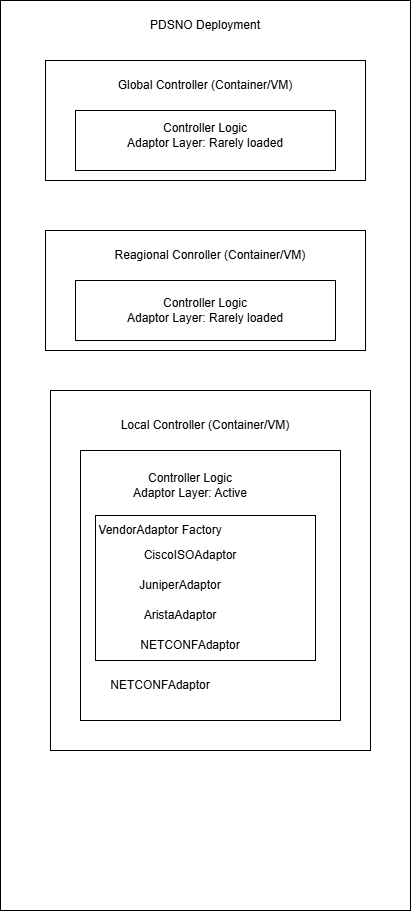

# How it works

This page gives you a complete mental model of PDSNO in one read. It covers the architecture, how the three controller tiers relate, how data flows through the system, and where state lives. Concept pages linked throughout go deeper on each topic.

---

## The three-tier controller hierarchy

PDSNO organises control intelligence across three tiers. Each tier has distinct authority and responsibility — this is not redundancy, it is a deliberate governance structure.

```
global_cntl_1 (primary)    global_cntl_2 (standby)
       │                           │
       └─────────── East/West ─────┘
                       │
          ┌─────────────┼─────────────┐
          ▼             ▼             ▼
  regional_cntl_1  regional_cntl_2  ...
          │
     ┌────┼────┐
     ▼    ▼    ▼
  lc_1  lc_2  lc_3  ...
```

!!! note "Draft diagram"
        This architecture visual is not final and will be refined as implementation details stabilize. It is included now to make the design intent clear.



| Tier | Scope | Primary responsibilities |
|------|-------|------------------------|
| **Global Controller** | Entire network | Root of trust, global policy, HIGH-sensitivity approvals, cross-region anomaly detection |
| **Regional Controller** | One geographic zone | LC validation (delegated), MEDIUM/LOW approvals, discovery aggregation |
| **Local Controller** | Direct device reach | Device discovery, config execution, first responder to device events |

**Why hierarchy instead of a flat peer-to-peer architecture?**

A flat architecture would be faster — controllers communicate as peers without routing through a root. PDSNO deliberately accepts this latency cost in exchange for three governance properties that a flat architecture cannot provide:

- A single, unambiguous root of trust for controller identity
- A clear chain of custody for high-sensitivity changes
- A defined authority hierarchy for policy — no ambiguity about which controller's policy wins in a conflict

---

## The Network Information Base

The NIB is the central concept that makes everything else possible. Every controller in PDSNO is **stateless with respect to network knowledge** — no controller trusts its own memory for network facts. All state that matters is written to the NIB before any action is taken based on it.

```
┌──────────────────────────────────────────────────────┐
│                  NIB — State Layer               │
│                                                  │
│  Device Table      │  Config Table               │
│  Metadata Store    │  Policy Table               │
│  Event Log         │  Controller Sync Table      │
└──────────────────────────────────────────────────────┘
```

The NIB has six modules, each with a distinct role:

- **Device Table** — every discovered network device, keyed by MAC address
- **Metadata Store** — extended device attributes (vendor, firmware, interfaces, uptime)
- **Config Table** — every configuration proposal, approval, execution, and rollback record
- **Policy Table** — active policies distributed from Global → Regional → Local
- **Event Log** — the immutable audit trail. Append-only. Every decision, every change, every anomaly flag. Never deleted.
- **Controller Sync Table** — coordination locks that prevent concurrent conflicting changes

Each controller tier maintains a **scoped NIB view** — Local Controllers see their subnet, Regional Controllers see their zone, the Global Controller sees the full network. Writes propagate upward through the hierarchy; policies propagate downward.

!!! important "The NIB rule"
    If a controller's local state disagrees with the NIB, the NIB wins and the controller reconciles. There is no exception to this.

→ Deep dive: [Network Information Base](../concepts/network-information-base.md)

---

## Three data flows

Everything PDSNO does reduces to three flows. Understanding these is the key to understanding the whole system.

### Flow 1 — Device discovery (upward)

```
Network devices
    │  ARP / ICMP / SNMP
    ▼
Local Controller
    Scans subnet → consolidates by MAC → diffs against NIB
    Writes new/updated/inactive records to Device Table
    Sends delta report to RC (changed devices only, not full inventory)
    │
    ▼
Regional Controller
    Validates report → deduplicates across LCs → writes to regional NIB
    Detects cross-LC anomalies → sends summary to GC
    │
    ▼
Global Controller
    Global deduplication → updates global NIB view
    Escalates flagged anomalies to NBI
```

**Key design decisions in this flow:**

Delta reporting only — LCs send only what changed, not the full device inventory. This keeps the system scalable as the network grows.

MAC address as the canonical key — IP addresses change, hostnames change, MAC addresses are hardware-bound and stable. Everything deduplicates on MAC.

Failed scans do not delete data — a device not seen in one cycle is not immediately marked inactive. Multiple consecutive missed cycles are required before status changes, preventing transient network noise from polluting the NIB.

→ Deep dive: [Device discovery](../concepts/device-discovery.md)

---

### Flow 2 — Configuration approval (down, then up)

This is the most important flow to understand. Configuration changes do not execute directly — they travel through a structured approval process before a single device is touched.

```
Local Controller
    Proposes change → writes PENDING to Config Table → sends to RC
    │
    ▼
Regional Controller
    Re-classifies sensitivity independently (LC suggestion is advisory only)
    Acquires device locks
    LOW/MEDIUM → approves, issues signed execution token
    HIGH → escalates to GC, awaits response
    │ (if HIGH)
    ▼
Global Controller
    Checks immutable policy rules
    Approves or denies → issues HIGH-category execution token
    │
    ▼ (approval flows back down)
Regional Controller → instructs LC to execute
    │
    ▼
Local Controller
    Verifies token (signature + bindings + expiry + single-use check)
    Writes EXECUTING → applies config to devices → writes EXECUTED or FAILED
    On failure → executes rollback → writes ROLLED_BACK or DEGRADED
    Releases device locks → reports result upstream
```

**The execution token** is what makes this auditable and tamper-resistant. Every approved change produces a single-use token cryptographically bound to: the specific proposal, the config hash, the list of affected devices, the approving controller's identity, and an expiration timestamp. A change cannot execute without a valid token. A token cannot be reused.

**Sensitivity classification** happens at two levels. The LC suggests a sensitivity level (LOW / MEDIUM / HIGH / EMERGENCY). The RC re-classifies independently based on its own policy evaluation. The LC's suggestion is treated as advisory only — a compromised Local Controller claiming LOW for a dangerous change is caught at the Regional Controller.

→ Deep dive: [Config approval](../concepts/config-approval.md)

---

### Flow 3 — Policy distribution (downward only)

```
Global Controller
    Policy created/updated → writes to Policy Table → publishes via MQTT
    │
    ▼
Regional Controllers (subscribed)
    Receive delta → validate signature + version → write to regional Policy Table
    Re-publish to regional MQTT topic
    │
    ▼
Local Controllers (subscribed)
    Receive delta → validate → write to local Policy Table
    All future proposals use the new policy version
```

Policy flows in one direction only — downward from the Global Controller. Regional and Local Controllers never write to the Policy Table directly. This design makes policy conflicts impossible by construction: there is only ever one canonical policy, and it comes from the top.

Any proposal submitted with a mismatched policy version is rejected. This prevents a Local Controller operating on an outdated policy from slipping a change through that would have been blocked under the current version.

→ Deep dive: [Policy propagation](../concepts/policy-propagation.md)

---

## Controller validation — how trust is established

Before any controller participates in PDSNO, it must be validated. This is not optional and cannot be skipped. The validation flow is a six-step cryptographic process:

```
Step 1  Timestamp freshness check — reject stale or future-dated requests
Step 2  Bootstrap token verification — confirms legitimate provisioning
Step 3  Challenge issuance — validator sends a cryptographic nonce
Step 4  Challenge response — requesting controller signs the nonce with its private key
Step 5  Policy checks — region, controller type, and quota validation
Step 6  Atomic identity assignment — permanent ID, certificate, and NIB record written together
```

The trust chain is rooted at the Global Controller:

- GC validates Regional Controllers directly
- Validated RCs receive a delegation credential allowing them to validate Local Controllers in their zone
- A Local Controller submits its validation request to its Regional Controller, not the Global Controller

If the Global Controller is unavailable, no new Regional Controllers can be validated and no new trust can be established. Existing validated controllers continue operating within their approved authority. This is a deliberate constraint — trust cannot be bootstrapped without the root.

→ Deep dive: [Controller validation](../concepts/controller-validation.md)

---

## How controllers communicate

PDSNO uses two protocols, chosen based on message type:

| Protocol | Used for | Why |
|----------|----------|-----|
| **REST / HTTP** | Validation, config approval, discovery reports | Request-response — the sender needs a definite answer before proceeding |
| **MQTT pub/sub** | Policy distribution, state change events, NIB sync notifications | Broadcast — one publisher, many subscribers, no polling |

**Delta-sync principle** — controllers only exchange what changed, never full state dumps. Every NIB entity has a version integer. When a controller processes a change, it publishes the changed entity (not the full table) to the relevant MQTT topic. Subscribing controllers merge the delta into their local view.

→ Deep dive: [Communication model](../concepts/communication-model.md)

---

## Internal controller structure

Every controller — regardless of tier — has the same four internal components:

```
┌──────────────────────────────────┐
│         DECISION ENGINE          │  Approval logic, policy checks,
│                                  │  escalation decisions
├──────────────────────────────────┤
│      COMMUNICATION LAYER         │  REST server (inbound)
│                                  │  MQTT client (pub/sub)
├──────────────────────────────────┤
│          DATA LAYER              │  NIBStore interface — all reads/
│                                  │  writes go through here
├──────────────────────────────────┤
│       ALGORITHM MODULES          │  Discovery, validation, optimisation
│                                  │  All follow initialize/execute/finalize
└──────────────────────────────────┘
```

Every operational module in PDSNO — discovery, validation, congestion handling, policy execution — follows a three-phase lifecycle: `initialize(context)` → `execute()` → `finalize()`. This enforces consistency and makes each module predictable to implement, test, and audit independently.

---

## System interfaces

PDSNO uses the ONF TR-521 standard interface naming throughout:

| Interface | Direction | Purpose |
|-----------|-----------|---------|
| **NBI** (Northbound) | Controller → Applications above | Exposes orchestration capabilities to external tools, dashboards, and vendor adapters |
| **SBI** (Southbound) | Controller → Devices below | Communicates with managed network devices via NETCONF, SNMP, ARP, ICMP |
| **East/West** | Controller ↔ Controller | Peer communication at the same tier; also used for the hierarchical validation flow |

---

## Putting it together — a complete scenario

Here is what happens when a network engineer submits a BGP policy change affecting a core router, traced through the full system:

1. **LC creates a proposal** — validates device is in the NIB and reachable, hashes the config payload, writes `PENDING` to Config Table, sends to RC
2. **RC re-classifies** — independently determines this is HIGH sensitivity based on BGP pattern matching against regional policy. Acquires a device lock in the Controller Sync Table
3. **RC escalates to GC** — attaches blast radius calculation and critical device flags. Awaits GC response (300s timeout; default-deny on timeout)
4. **GC validates** — checks immutable policy rules, assesses cross-region impact. Approves. Issues a HIGH-category execution token with a 5-minute TTL
5. **Token travels downward** — GC → RC → LC
6. **LC verifies the token** — checks signature, binding to this specific proposal and config hash, expiry, and that it hasn't been used before. Marks token consumed
7. **LC writes `EXECUTING`** to Config Table before touching any device
8. **LC applies config** to the router via SBI. On success: writes `EXECUTED`, releases device lock, reports result upstream. On failure: executes rollback from stored rollback payload, writes `ROLLED_BACK` or `DEGRADED`
9. **Audit trail is complete** — the Event Log has signed entries for every step from proposal to execution, written by the controller that took each action

Total time for a HIGH-sensitivity change in a healthy network: typically 3–10 seconds for the approval round-trip, plus execution time on the device.

---

## Next steps

Now that you have the mental model, the concept pages go deeper on each component:

- [Controller hierarchy](../concepts/controller-hierarchy.md) — tier responsibilities, offline behaviour, naming conventions
- [Controller validation](../concepts/controller-validation.md) — the full six-step flow with error states
- [Network Information Base](../concepts/network-information-base.md) — schema, consistency model, write protocol
- [Config approval](../concepts/config-approval.md) — sensitivity tiers, execution tokens, rollback
- [Device discovery](../concepts/device-discovery.md) — scan protocols, delta detection, anomaly flags
- [Security model](../concepts/security-model.md) — trust boundaries, cryptographic assumptions