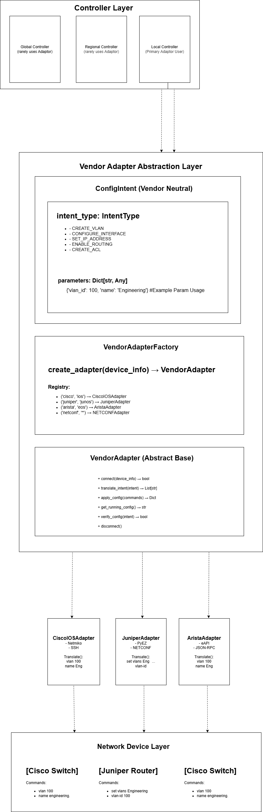
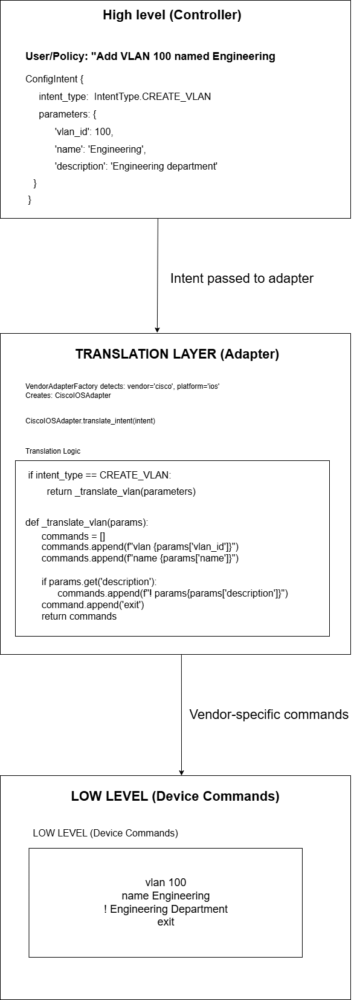
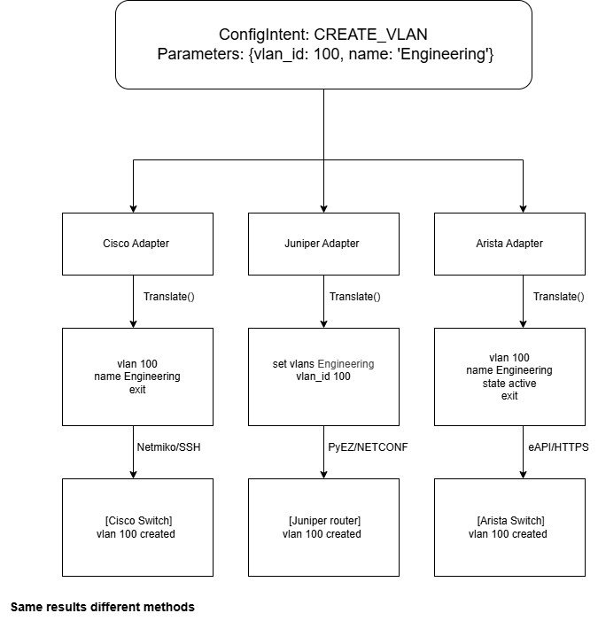

# Gap analysis

This page maps documented shortcomings of major proprietary network orchestration platforms to PDSNO capabilities. Each gap section covers: what the vendor's product does not do well, what PDSNO addresses, and how mature PDSNO's response currently is.

This is a living document. Update it as customer conversations produce concrete feedback. Real practitioner pain trumps any amount of market research — when a network engineer tells you their specific problem, write it down here with a date and an anonymised source label.

!!! note "Draft diagrams"
	The following visuals are early versions and will improve as the project grows. They are included now to clarify the core adapter and translation ideas.

---

## Gap 1 — Vendor lock-in at the orchestration layer

### The problem

Cisco ACI delivers its full benefits only on Cisco Nexus hardware. VMware NSX delivers its full benefits only within the VMware hypervisor stack. Most enterprise organisations run both, plus additional hardware from other vendors, plus cloud infrastructure. Each vendor's orchestration tool manages its own domain well and the rest of the network poorly or not at all.

The result: network engineers operate multiple dashboards, multiple policy systems, and multiple audit trails — one per vendor — with no single place to see or govern the whole network. Manual reconciliation between these systems is where errors happen and where incidents are slow to diagnose.

This is not a criticism of any single vendor. It is a structural property of the market: each vendor has an incentive to make their tool excellent within their ecosystem and indifferent to everything outside it.

**Evidence:** Juniper's acquisition of Apstra was explicitly motivated by customer demand for multi-vendor management. The fact that a company was acquired for this capability confirms the gap is real and valued. VMware NSX users consistently report that "extending integration to third-party systems or non-VMware environments can be challenging" — a consistent theme in practitioner reviews.

### PDSNO's response

PDSNO's architecture is vendor-agnostic by design. The controller hierarchy does not assume any specific vendor at any layer. The NIB stores device state regardless of what vendor manufactured the device or what tool discovered it.

The specific capability needed: a vendor adapter layer — modules that connect to each major vendor's northbound API and pull device state, topology, and events into the NIB. Once in the NIB, all PDSNO capabilities apply to that data uniformly.

**Planned adapters (priority order):**

| Adapter | Target API | Priority | Phase |
|---------|-----------|----------|-------|
| Cisco ACI | APIC REST API | High | Phase 7 |
| VMware NSX | NSX Manager REST API | High | Phase 7 |
| Juniper JunOS | JunOS REST / NETCONF | Medium | Phase 8 |
| Generic NETCONF | RFC 6241 | Medium | Phase 8 |
| Generic SNMP | SNMP v2c/v3 (fallback for legacy) | Low | Phase 8 |

**Maturity:** Architecture designed. Implementation planned for Phase 7. Not yet implemented.

---

## Gap 2 — Multi-domain policy consistency

### The problem

When an organisation runs Cisco ACI in its data centre, VMware NSX for virtualisation, and a third-party SD-WAN at its branches, there is no single system that enforces consistent policy across all three. Each tool has its own policy model, its own syntax, and its own enforcement mechanism.

A compliance requirement — for example, "no unencrypted traffic between VLAN 10 and the internet" — must be manually translated into three different policy configurations in three different tools. When the policy needs to change, it must be updated in all three simultaneously. Drift between them is not detected automatically. Audit evidence of compliance is scattered across three separate logs.

For regulated industries, this is not just an operational headache — it is a compliance liability. Auditors ask for a unified policy audit trail and most organisations cannot produce one.

**Evidence:** Cisco's own documentation describes ACI's policy model as applying to its fabric. The northbound APIs allow third-party systems to read and write policy — but the translation layer and consistency enforcement between multiple vendor policy engines is left to the customer to build. Cisco ACI's Multi-Site Orchestrator addresses this problem partially — but only across multiple Cisco ACI fabrics, not across Cisco + VMware + others.

### PDSNO's response

PDSNO's policy propagation system is designed exactly for this problem. The Global Controller holds the canonical policy. Regional Controllers enforce it within their zones. The distribution mechanism is version-controlled and auditable — every policy version is stored with a timestamp and the identity of the controller that distributed it.

The specific capability needed: a policy translation layer — the ability to take a PDSNO policy definition and translate it into the native format required by each vendor's API. A Cisco ACI adapter would translate PDSNO policy into APIC tenant/EPG/contract constructs. A VMware NSX adapter would translate into NSX security groups and distributed firewall rules.

This requires defining a **PDSNO Common Policy Model** — a vendor-neutral representation — and building per-vendor translators. This is technically non-trivial because each vendor's policy model has different abstractions.

**Maturity:** Policy propagation architecture designed and documented. Common Policy Model not yet defined. Translation adapters not yet implemented. Phase 8–9 work.

---

## Gap 3 — Cross-domain change governance and auditability

### The problem

When a configuration change touches multiple vendor domains simultaneously — a firewall rule change requiring updates in Cisco ACI, VMware NSX, and a branch SD-WAN — there is no single tool that:

- Requires approval before the change is applied across all three
- Issues a single execution token authorising the change
- Ensures all three changes succeed or all three roll back
- Produces a single audit record covering the entire cross-domain change

Each vendor's tool has its own change management workflow, its own approval mechanism, and its own audit log. Reconstructing what happened across all three after an incident is a manual, time-consuming process.

For organisations subject to SOX, PCI-DSS, HIPAA, or NIS2, the inability to produce a unified change audit trail is a real and recurring problem during audits.

**Evidence:** VMware's own product guide notes that NSX "is not a comprehensive regulatory compliance solution" — confirming the compliance gap is acknowledged even by the vendor. Real user reviews note that VMware NSX has "logs everywhere — on Edge servers, vCenter, or ESXi" making troubleshooting difficult. This reflects the absence of a unified audit log.

### PDSNO's response

PDSNO's configuration approval logic is purpose-built for this problem:

- **Sensitivity tiers** — changes are classified LOW/MEDIUM/HIGH/EMERGENCY with appropriate approval paths for each
- **Execution tokens** — cryptographically signed, single-use, bound to the specific change, devices, and time window. A change cannot execute without a valid token.
- **Unified audit log** — the NIB Event Log captures every proposal, approval, execution, and rollback with a signed entry, regardless of which vendor domain the change touches
- **Rollback support** — rollback instructions are stored at proposal time so they are available immediately if execution fails

The specific value this creates for regulated customers: a compliance report showing, for any time period, every change proposed, who proposed it, who approved it, when it was applied, and what the before/after state was — across all vendor domains in a single document. This is currently impossible with vendor-native tools alone.

**Maturity:** Configuration approval logic designed and implemented. Compliance report output format not yet designed. Cross-domain execution (applying a single approved change across multiple vendor APIs simultaneously) requires the Phase 7 adapter layer.

---

## Gap 4 — Cross-tier incident correlation

### The problem

When a network incident occurs in a multi-vendor environment, correlating events across vendor domains to reconstruct the incident timeline is extremely difficult. Cisco ACI has its own fault logs. VMware NSX has events in its own system. The physical switches have syslog. The SD-WAN has its own telemetry.

An incident that starts as a routing anomaly on a physical switch can manifest as application timeouts in the VMware layer, trigger alerts in the monitoring system, and cause secondary failures in other domains — all within seconds. No vendor-native tool sees the full picture because no single vendor owns the full stack.

Network engineers spend significant time in incident response manually correlating timestamps and events across separate systems. Mean time to resolution is longer than it needs to be because the correlation is manual.

**Evidence:** VMware NSX user reviews note the product has "its own definition of terms and design, making it difficult to troubleshoot" — a symptom of the isolation problem. Juniper's AI-driven telemetry (Mist AI) is a partial answer but scoped to Juniper's own ecosystem.

### PDSNO's response

The NIB's unified Event Log is the foundation for cross-tier incident correlation. Because all controllers write to the same Event Log with a consistent format and UTC timestamps, correlating events across domains becomes a query rather than a manual reconstruction.

Given an incident timestamp, PDSNO can produce a timeline of all events across all vendor domains recorded in the NIB within a defined window around that timestamp.

A future enhancement that amplifies this significantly: when vendor adapters pull events from each vendor's API into the NIB Event Log in real time, PDSNO becomes a true cross-domain event correlation engine — not just for PDSNO-originated changes, but for anything happening across the managed infrastructure.

**Maturity:** NIB Event Log designed and implemented. Cross-domain correlation query interface not yet designed. Vendor event ingestion not yet implemented — requires Phase 7 adapters.

---

## Gap 5 — Complexity and learning curve for multi-vendor operations

### The problem

Each major vendor's orchestration platform has a steep learning curve. Cisco ACI's policy model — EPGs, contracts, bridge domains, VRFs, tenants — requires significant training to use correctly. VMware NSX has a similarly steep learning curve. API usage for configurations not accessible via the GUI further increases complexity.

When an organisation runs both Cisco ACI and VMware NSX, their network engineers must be proficient in both policy models simultaneously. Hiring for this combination is expensive. Training is slow. Operational errors increase when engineers work across unfamiliar abstractions.

This problem compounds at scale: a large enterprise with multiple regional data centres may have different vendor footprints in different regions, multiplying the operational complexity further.

### PDSNO's response

PDSNO does not eliminate the need to understand vendor-native tools. What it reduces is how often engineers need to drop into vendor-native interfaces for common governance tasks.

The operational tasks that PDSNO centralises — change approval, policy distribution, audit logging, controller validation — currently require navigating each vendor's interface separately. By centralising these in PDSNO, engineers manage governance from a single interface even if the underlying execution happens in vendor-native systems.

This is a long-term positioning advantage. As the vendor adapter layer matures, the abstraction grows. The goal is not to replace vendor UIs for configuration — it is to make governance, auditing, and cross-domain change management something an engineer does in one place.

**Maturity:** Architecture supports this vision. UI layer not yet designed or implemented. Phase 8+ work.

---

## What to track going forward

### Vendor product updates

**Cisco Nexus Dashboard Orchestrator** — Cisco is actively expanding NDO's multi-site and multi-domain capabilities. Track whether they close the cross-vendor gap themselves. If they do, reassess Gap 1.

**Juniper Apstra** — monitor feature releases. If Juniper deprioritises multi-vendor support (which their ownership incentive suggests they might), that is a market opportunity.

**VMware NSX under Broadcom** — Broadcom's acquisition has caused customer uncertainty and price increases. Some NSX customers are evaluating alternatives. This creates a window.

### Regulatory developments

**NIS2 Directive (EU)** — effective 2024–2025. Organisations subject to NIS2 need better change governance tooling.

**DORA (EU Financial Services)** — effective January 2025. Requires demonstrable operational resilience including network change management.

**US CISA guidance** — ongoing. Any new requirements for federal contractors or critical infrastructure create demand for audit tooling.

---

## Customer discovery questions

When talking to potential customers, use these questions to validate or refute the gaps above:

1. "How many different network management tools or dashboards does your team use day-to-day?"
2. "When you need to make a change that touches more than one vendor's equipment, what does that process look like?"
3. "When something goes wrong in your network, what does the troubleshooting process look like? How do you reconstruct what happened?"
4. "If you had to show an auditor a complete record of every network change made in the last 90 days, how would you produce that?"
5. "What's the most painful part of managing your network that you wish someone would solve?"
6. "Are you able to enforce consistent security policy across all parts of your network, or are there gaps between vendor domains?"

A gap confirmed by five real practitioners is worth more than any amount of market research. Update this document when conversations produce concrete evidence.

---

## Related pages

- [Vendor analysis overview](overview.md) — positioning summary and competitive landscape
- [What is PDSNO](../getting-started/what-is-pdsno.md) — how PDSNO describes itself to potential adopters
- [System goals](../getting-started/system-goals.md) — the design principles that inform the competitive positioning